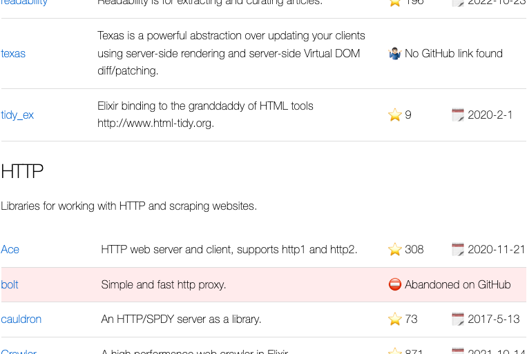

# Awex

Awesome Elixir List with everyday update on stars and the latest commit. It looks like this:



## Build for Production
Create an `.env` file based on `.env.example`. 

Run `docker compose up -d --build`.

## Run Tests
There are a couple of integration tests, you'll need to pass `GITHUB_USER_TOKEN` environment variable with a classic GitHub user token and also configure the test DB in `config/test.exs`:

```sh
GITHUB_USER_TOKEN=... mix test
```

Check `test` task and predefined ENV variables in `Makefile.example`.

## Setup for Development
Having PostgreSQL up and running you can use `run` task from `Makefile.example`.

## TODO
- [ ] Only GitHub links are checked for stars and the last commit date. We can also get some stats from GitLab as well.

## Further Improvement Ideas
We can use GraphQL API to make a batch query to update up to 100 libs at a time. It looks like this:

```graphql
query GetSectionReposInfo($repos: String!) {
  search(query: $repos, type: REPOSITORY, first: 100, after: null) {
    repositoryCount
    
    nodes {
      ... on Repository {        
        name
        url
        owner {
          login
        }
        stargazers {
          totalCount
        }        
        defaultBranchRef {
          target {
            ... on Commit {
              history(first: 1) {
                edges {
                  node {
                    committedDate
                  }
                }
              }
            }
          }
        }
      }
    }
  }
}
### variables
{"repos": "repo:rmies/monad repo:... ..."}
```

 But looks like it doesn't support redirects for repos with changed owner/name. Single query does support redirects and that's because we use it now. Probably, we could update what we can with batch query and then fill in the gaps with single queries for libs with changed owner/name.

